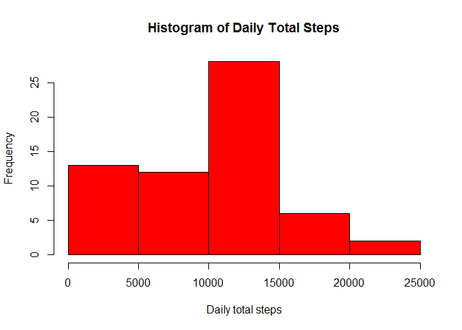
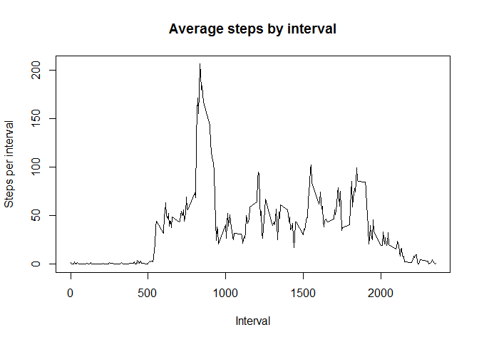
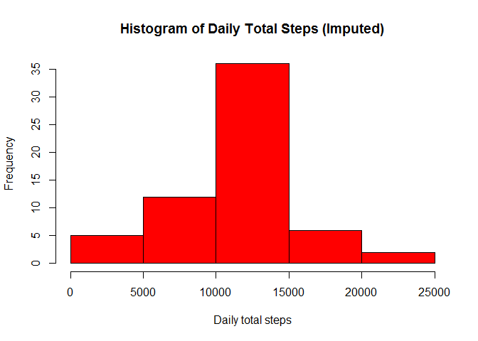
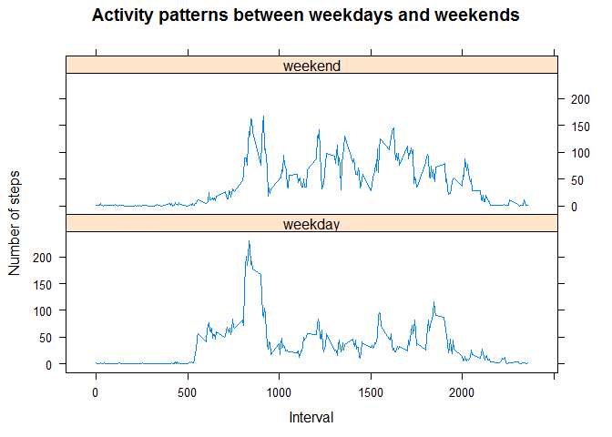

# Reproducible Research: Peer Assessment 1


## Loading and preprocessing the data

```r
if (!file.exists("activity.csv")) unzip("activity.zip")
act <- read.csv("activity.csv")
str(act)
```

```
## 'data.frame':	17568 obs. of  3 variables:
##  $ steps   : int  NA NA NA NA NA NA NA NA NA NA ...
##  $ date    : Factor w/ 61 levels "2012-10-01","2012-10-02",..: 1 1 1 1 1 1 1 1 1 1 ...
##  $ interval: int  0 5 10 15 20 25 30 35 40 45 ...
```

```r
# Convert date to date format
act$date <- as.Date(act$date)
str(act)
```

```
## 'data.frame':	17568 obs. of  3 variables:
##  $ steps   : int  NA NA NA NA NA NA NA NA NA NA ...
##  $ date    : Date, format: "2012-10-01" "2012-10-01" ...
##  $ interval: int  0 5 10 15 20 25 30 35 40 45 ...
```

## What is mean total number of steps taken per day?

```r
# First install dplyr
library(dplyr)
```


```r
# find daily totals
daily_totals <- act %>% group_by(date) %>% summarise(total = sum(steps, na.rm = TRUE))
hist(daily_totals$total,main = "Histogram of Daily Total Steps", xlab = "Daily total steps", col = "red"  )
```

 

```r
stepmean <- mean(daily_totals$total)
stepmedian <- median(daily_totals$total)
```
Mean of daily total steps is **9354.2295082**  
  
Median of daily total steps is **10395**


## What is the average daily activity pattern?

```r
# Summarise by interval:
avg_by_interval <- act %>% group_by(interval) %>% summarise(int_avg = mean(steps, na.rm = TRUE))
plot(avg_by_interval$interval,avg_by_interval$int_avg, type = "l", 
     main="Average steps by interval", ylab = "Steps per interval", xlab = "Interval")
```

 

```r
# Determine which interval has highest average steps: 
max_steps <- max(avg_by_interval$int_avg)
max_int <- avg_by_interval$interval[ avg_by_interval$int_avg == max_steps]
```
The interval with the highest average steps is **835** with **206.1698113** steps


## Imputing missing values

```r
missing_rows <- is.na(act$steps)
no_missing <- sum(missing_rows)
```
There are **2304** rows with missing values.

```r
# Function to impute missing steps. Use Interval Average:
int_avg <- function( interval ) { 
    avg_by_interval$int_avg[avg_by_interval$interval == interval]
}
# Create new dataset for imputing
act_imp <- act
act_imp$steps[missing_rows] <- sapply(act_imp$interval[missing_rows], int_avg)
head(act_imp)
```

```
##       steps       date interval
## 1 1.7169811 2012-10-01        0
## 2 0.3396226 2012-10-01        5
## 3 0.1320755 2012-10-01       10
## 4 0.1509434 2012-10-01       15
## 5 0.0754717 2012-10-01       20
## 6 2.0943396 2012-10-01       25
```

```r
# Histogram of imputed data
daily_totals_imp <- act_imp %>% group_by(date) %>% summarise(total = sum(steps, na.rm = TRUE))
hist(daily_totals_imp$total,main = "Histogram of Daily Total Steps (Imputed)", xlab = "Daily total steps", col = "red"  )
```

 

```r
stepmean_imp <- mean(daily_totals_imp$total)
stepmedian_imp <- median(daily_totals_imp$total)
```
Mean of imputed daily total steps is **10766.19**  
  
Median of imputed daily total steps is **10766.19**    
  
The effect of imputing the values is:   

* Distribution is more symmetric looking. Raw data was very "bottom heavy"  
* Both mean and media values increased  
* Mean and median values converged to the same value  

## Are there differences in activity patterns between weekdays and weekends?

```r
# Create new data set with day type column
act_day_type <- act_imp %>% 
                    mutate(day_type = ifelse(weekdays(date) %in%
                                               c("Saturday","Sunday"), 
                                             "weekend", 
                                             "weekday"))
act_day_type$day_type <- as.factor(act_day_type$day_type)
# Now sum by day type/interval :
avg_by_intvl_day <- act_day_type %>% 
                    group_by(day_type, interval) %>% 
                    summarise(int_avg = mean(steps))
# Plot this with lattice system :
library(lattice)
xyplot(int_avg~interval|day_type, data=avg_by_intvl_day, type="l", 
       layout =c(1,2), xlab = "Interval", ylab = "Number of steps",
       main="Activity patterns between weekdays and weekends")
```

 

Observations : 

* Earlier start to activity on weekdays - lie-in at the weekend!  
* More activity throughout the day at weekends  

